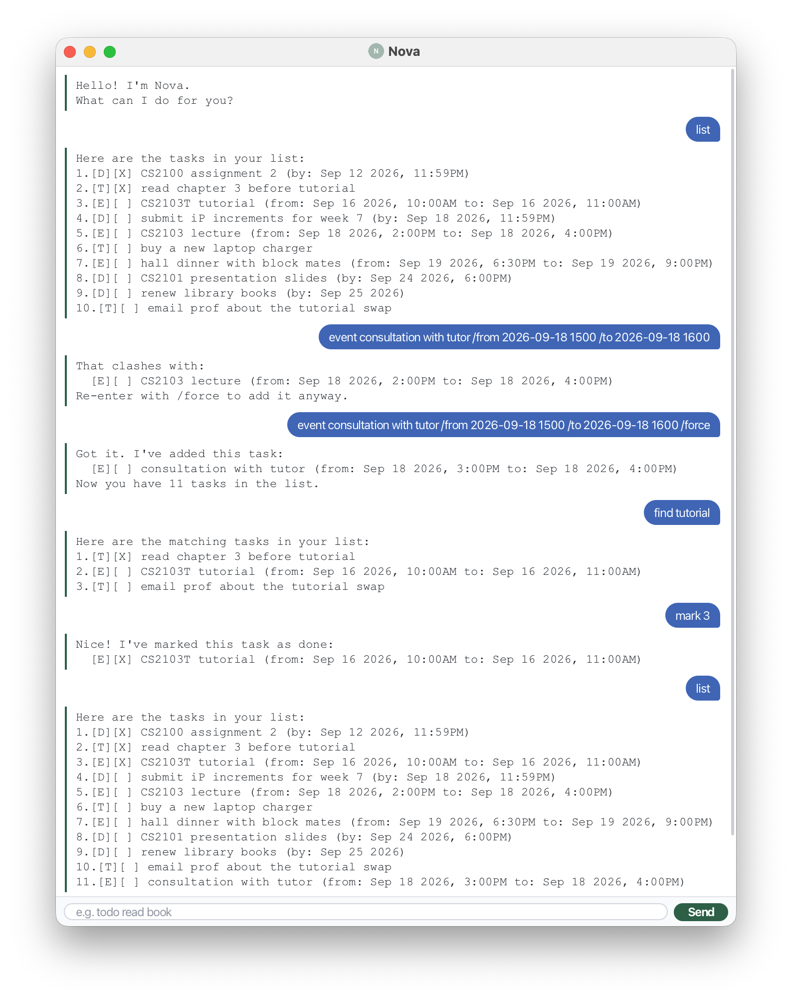

# Nova User Guide



**Nova** keeps track of your tasks and warns you when two events overlap.
Type a command, press Enter, and it saves as you go.

## Getting started

1. Install **Java 25**.
2. Put `nova.jar` in a folder of its own — Nova keeps your tasks next to it.
3. Run `java -jar nova.jar`.
4. Type in the box at the bottom. Try `todo read book`, then `list`.

## Commands at a glance

| Action | Format |
| --- | --- |
| Add a task | `todo DESCRIPTION` |
| Add something due by a date | `deadline DESCRIPTION /by DATE` |
| Add something with a start and end | `event DESCRIPTION /from DATE /to DATE` |
| See everything | `list` |
| Tick off / un-tick | `mark INDEX` / `unmark INDEX` |
| Remove | `delete INDEX` |
| Search | `find KEYWORD` |
| Book an event anyway | `event ... /to DATE /force` |
| Say goodbye | `bye` |

Command words aren't case sensitive. `INDEX` is the number `list` shows.

## Dates

Write dates as `2026-09-25`, or `2026-09-25 1800` if the time matters — that's
a 24-hour clock, four digits, no colon. Keep the leading zeros (`2026-09-05`,
`0900`). Leave the time off and Nova leaves it off the display too.

## Adding tasks

```
todo buy a charger
deadline submit report /by 2026-09-25 1800
event project meeting /from 2026-09-19 1000 /to 2026-09-19 1130
```

Nova confirms each one:

```
Got it. I've added this task:
  [E][ ] project meeting (from: Sep 19 2026, 10:00AM to: Sep 19 2026, 11:30AM)
Now you have 5 tasks in the list.
```

## Seeing everything

`list`

```
Here are the tasks in your list:
1.[T][ ] buy a charger
2.[T][ ] read book
3.[D][ ] return book (by: Sep 25 2026)
4.[D][ ] submit report (by: Sep 25 2026, 6:00PM)
5.[E][ ] project meeting (from: Sep 19 2026, 10:00AM to: Sep 19 2026, 11:30AM)
```

`[T]` `[D]` `[E]` are the three types; `[X]` means done.

## Ticking off and removing

`mark 2`, `unmark 2`, `delete 3`

```
Nice! I've marked this task as done:
  [T][X] read book
```

After a delete, everything below moves up — run `list` again before the next one.

## Searching

`find book`

```
Here are the matching tasks in your list:
1.[T][ ] read book
2.[D][ ] return book (by: Sep 25 2026)
```

These numbers count the matches, not positions in your list. Run `list` to get
the real number before you mark or delete one.

## Clashing events

Nova won't double-book you. If a new event overlaps one you already have:

```
That clashes with:
  [E][ ] project meeting (from: Sep 19 2026, 10:00AM to: Sep 19 2026, 11:30AM)
Re-enter with /force to add it anyway.
```

Put `/force` at the end of the command to add it regardless.

- Only events clash — todos and deadlines never do.
- Back-to-back is fine: one ending at 11:30 and the next starting at 11:30 is
  not a clash.
- Events you've already marked done don't clash with anything.

## Good to know

- Your list saves itself to `data/nova.txt`. There's no save command.
- Don't use `|` in a description.
- `bye` says goodbye but leaves the window open — just close it.
